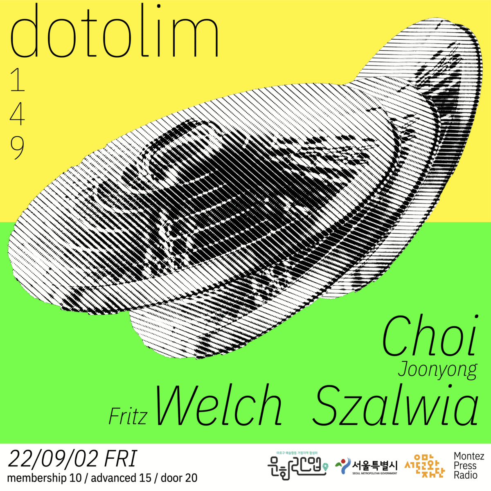
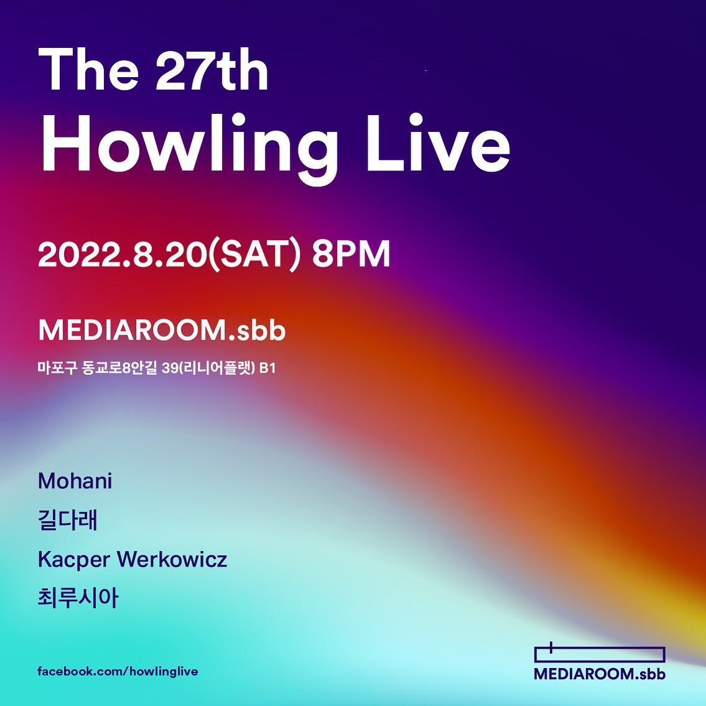
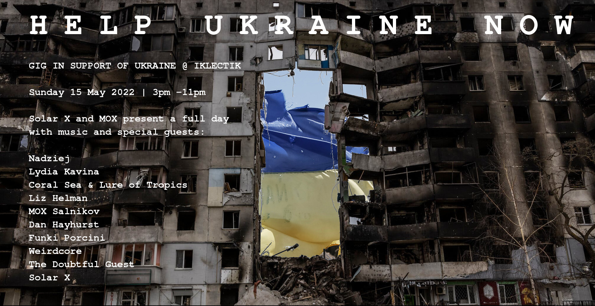
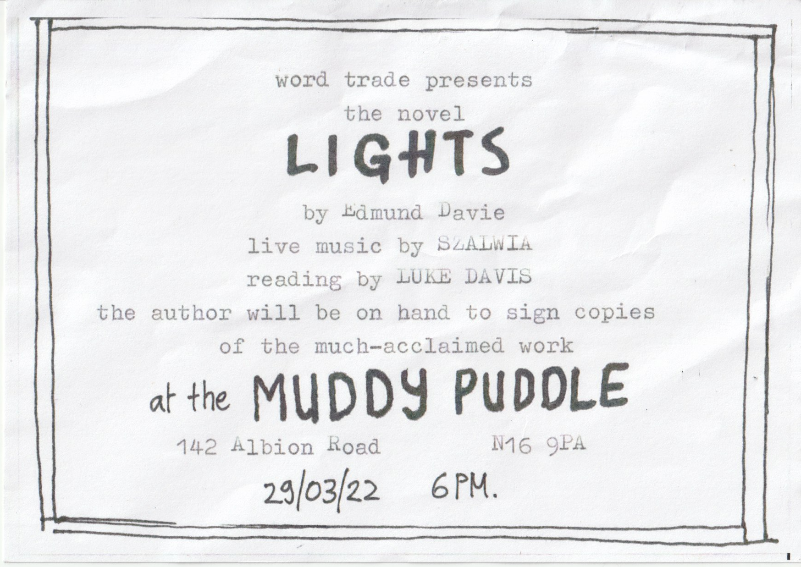
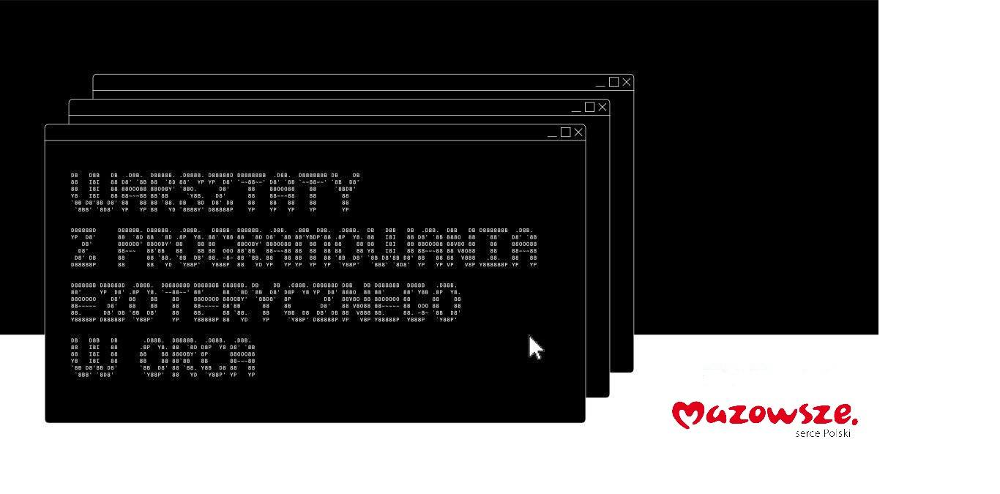
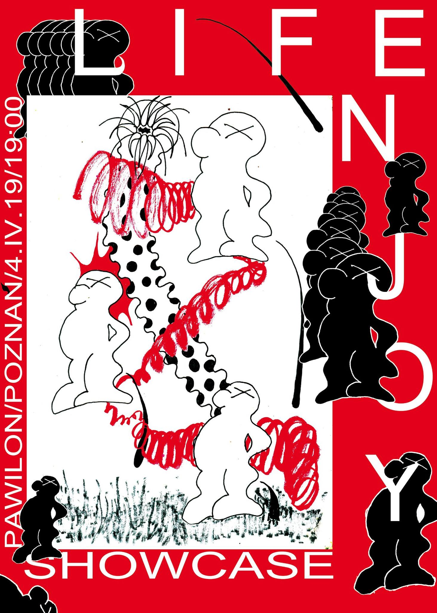

## 2.9.2022, Seoul, dotolim - dotolim concert_149 w/ **Fritz Welch, Choi Joonyong**

## 20.8.2022, Seoul, MEDIAROOM.sbb - The 27th Howling Live w/ Mohani, **Gildarae, Choelusia**

## 30.6.2022, London, The Old Kings Head - Launch event of Luke Davis’ POEMS w/  Luke Davis, Edmund Davie, Ben Watson, Kit Mackintosh, Sufi and others

## 16.6.2022, London, Goldsmiths Great Hall - Electronic Music Studios Multichannel Concert w/ Adam Barkley, Osian Gruffuydd, Edwin Hind, Pete Furniss, Sam L Taylor, Lorelai b Woch, Benjamin Whateley

tape music

## 11.6.2022, Whitstable, The Sounding Shore :: Coast To Coast at the Whitstable Biennale w/ Marcus Leadley, Two Wheels, Michael Zbyszynski, Concrete and Green, Monty Williams, Tansy Spinks and Iris Garrelfs, Ingrid Plum, Hardworking Families, Oishi, LFIEL

live performance

## 15.5.2022, London, IKLECTIK - HELP UKRAINE NOW Fundraiser /w Bodya Konakov,Lydia Kavina, MOX Salnikov, Coreal Sea and Lure of Tropics, Liz Helman, Day Hayhurst, Funki Porcini, The Doubtful Guest, Weirdcore, Solar X

live performance

## 9.5.2022, London, Goldsmiths - Music Computing 2 Recital

live performance

## 1.4.2022, London, St James’ Hatcham Church - Hacksmiths Live Coding Ensemble Performance

trio live coding performance

## 29.3.2022, London, The Muddy Puddle - R**elaunch of Edmund Davie’s novel LIGHTS w/ Edmund Davie, Luke Davis, Sufi**

live performance

## 25.3.2022, London, Zion Chapel - Ursonate w/ 9th Peroxide, Crimson Chaos, henrycyer, Corvus

live performance

![[web]ig story copy.png](dates/webig_story_copy.png)

## 24.2.2022, London, George Wood Theatre - Music Computing 2 Recital

live performance

## 5.11.2021, London, Zion Chapel - Ursonate

live performance

## Glissando 38/2020 - "Ewaluuj. Wprowadzenie do dźwiękowego live codingu."

article on live coding

## 16.12.2020, online - Warsztaty z programowania ezoterycznego ORCA

workshop on ORCA, an esoteric programming language

## 19.10.2019, Poznań, Pawilon - 48k możliwości

audiovisual installation

## 7.10.2019, Kraków, Klub RE - Into the Light

live coding set

## 8.9.2019, Łódź - Galeria Śmierć Frajerom jako część Festiwalu Łódź Czterech Kultur

live coding set

## 29.8.2019, Warszawa, Paloma Nad Wisłą - enjoy life plugged

live coding set

## 4.4.2019, Poznań, Pawilon - enjoy life music & art d-tour : the showcase

live set

## 29.9.2018, Warszawa, Klubokawiarnia Młodsza Siostra - Enjoy Life remix crash normal

live set

## 22.7.2018, Warszawa, Pogłos - Brutaż

live set

## 30.6.2018 Warszawa, Jasna 1 - HUCPA-3

live set, curation

## 11.5.2018 Wrocław, Uczulenie - Impreza Otwarcia: MAGIA Showcase, klub festiwalowy Docs Against Gravity

live set

## 5.5.2018 Warszawa, K55 - HEJKA

live set

## 6.4.2018 Warszawa, Przychodnia Skłot - MESTIÇO & Friends: Syria Aid

live set

## 25.1.2018 Warszawa, - Podwieczorek

live set, curation

## 15.12.2017 Warszawa, Widok 8 - HUCPA-2

live set, curation

## 18.11.2017 Warszawa, Pogłos - Brutaż

live set

## 10.10.2017 Warszawa, Pogłos - MAGIA

live set

## 19.8.2017 Warszawa, Chmury - Niemy Dotyk Tokyo Cha-Cha

live set

## 18.8.2017 Warszawa, Pogłos - umór 3

live set